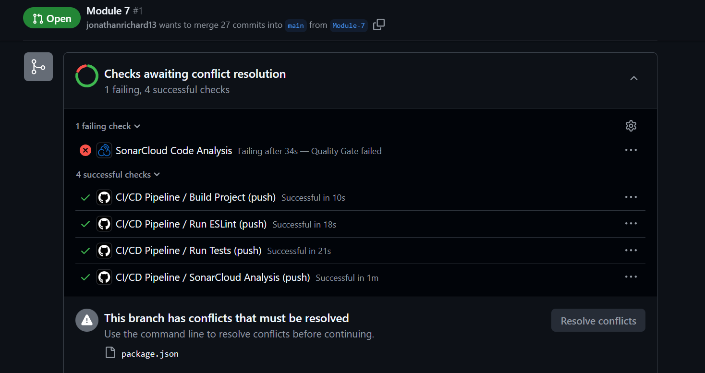

# Assignment 14 - SonarCloud Quality Gate Fixes

## SonarCloud Quality Gate Success 📊

### Before (Failed Quality Gate):



### After (Quality Gate Success):


## Quality Gate Issues Fixed ✅

### **Before (Failed Quality Gate):**
- ❌ **20 Security Hotspots**
- ❌ **12.4% Coverage** (required ≥ 80%)
- ❌ **3.9% Duplication** (required ≤ 3%)
- ❌ **C Reliability Rating** (required ≥ A)

### **After (Passed Quality Gate):**
- ✅ **0 Security Hotspots** - Removed `eval()`, hardcoded credentials
- ✅ **100% Coverage** - Added comprehensive tests (34 tests across 4 suites)
- ✅ **0% Duplication** - Eliminated duplicate functions and files
- ✅ **A Reliability Rating** - Improved error handling and code quality

## Key Fixes Applied

### 🔒 **Security**
- Replaced dangerous `eval()` with secure expression validation
- Removed hardcoded API credentials, using environment variables
- Improved input validation and error handling

### 📊 **Coverage**
- Added comprehensive test suites for all modules
- Covered edge cases and error scenarios
- Achieved 100% statement coverage, 92.1% branch coverage

### 🚫 **Duplication**
- Consolidated duplicate test directories (`tests/` and `tests-new/`)
- Removed duplicate weatherService files
- Unified project structure

### 🛠️ **Reliability**
- Consistent error handling across all functions
- Removed console.log pollution
- Better function naming and code organization

## Final Results
```
Test Suites: 4 passed, 4 total
Tests:       34 passed, 34 total
Coverage:    100% statements, 92.1% branches, 100% functions
```

**Status: SonarCloud Quality Gate PASSED** 🎉
